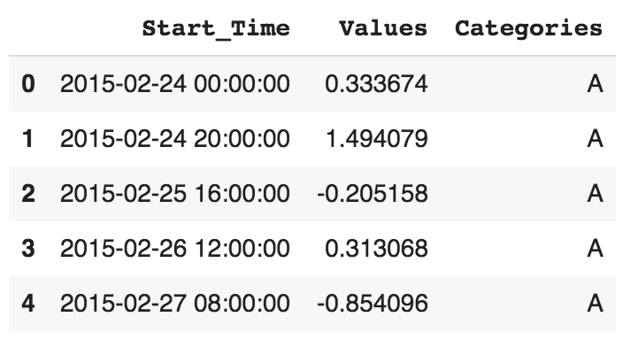
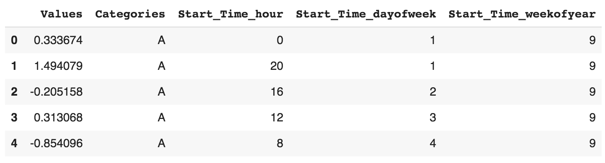
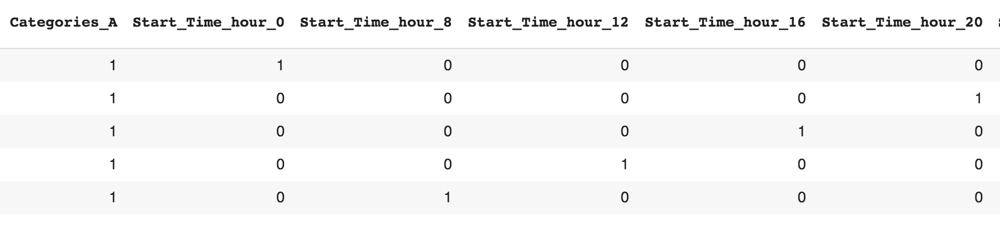
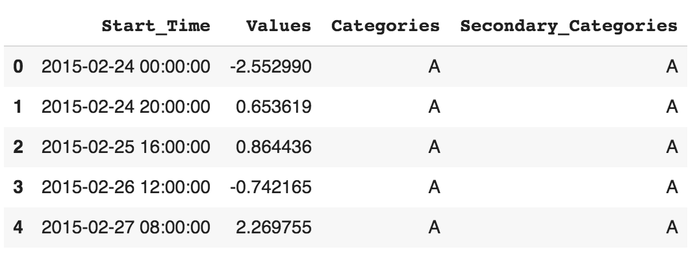

# DataJazz
Tools to jazz up your data.

DataJazz is toolkit for manipulating and optimizing your data for analysis, machine learning, extraction, transformation, and loading (ETL). 

## Contributing
DataJazz is an open-source project founded and maintained to better serve the data science and machine learning community. Please feel free to submit pull requests to contribute to the project. By participating, you are expected to adhere to DataJazz's [code of conduct](CODE_OF_CONDUCT.md).

## Installation
```
pip install datajazz
```

## Example usage

### Create a dataframe with different datatypes
```
import pandas as pd
import numpy as np

rng = pd.date_range('2015-02-24', periods=5, freq='20H')
df = pd.DataFrame({ 'Start_Time': rng, 'Values': np.random.randn(len(rng)), 'Categories': ['A']*len(rng) }) 
df.head()
```


### Create time-of-time features
```
import datajazz as dj
df = dj.timeoftime(df)
```


### One-hot encode your categorical columns
```
import datajazz as dj
df = dj.onehot_categories(df)
```


### Remove redundant rows and columns
```
import datajazz as dj
df = dj.remove_redundancies(df)
```



### Many more use cases to come! Submit a pull request to add a new use case.